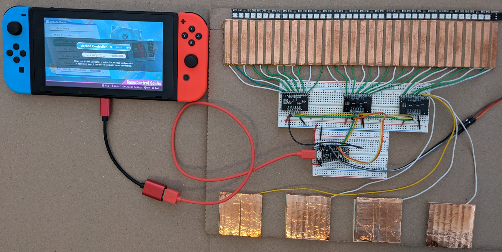
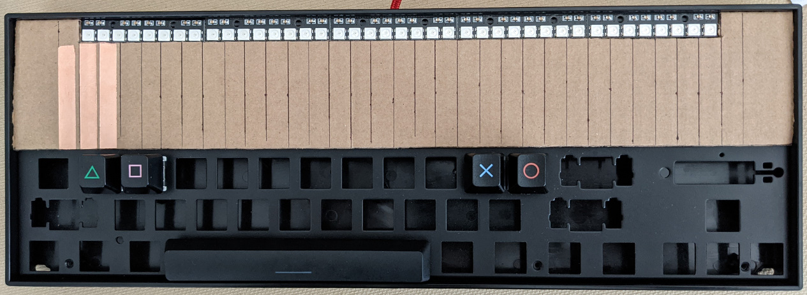

# DIY Project Diva Slide for Nintendo Switch

DIY Project Diva controller with slide for Nintendo Switch in progress.
Cardboard Diva controller with slide. The flattest Diva controller ever?
The Arcade Controller option must be enabled to use this.

Mechanical keyboard with slider. Work in progress.

[More pictures](./README_pictures.md)

## Hardware

### WS2812 RGB LED sticks

The LEDs are optional. They are handy for trouble shooting crossed
wires, touch sensitivity too high, etc. My design powers the LEDs
using 3.3V instead of 5V. The LEDs are dimmer but this is fine for me.
If you want to use max brightness and/or more LEDs use a separate power
supply for the LEDs.

https://www.amazon.com/dp/B07KD55QKJ

5 sticks with 8 LEDs per stick. Soldered end to end this comes out
slighly less than 12 inches. The 40 LEDs do not line up with the 32
slide electrodes.

Alternative: https://www.adafruit.com/product/1426

Each stick is 2 inches long so 6 sticks is exactly fits a 12 inch
slide. The 48 LEDs will not exactly line up with the 32 slide
electrodes but it is close enough. Each stick is $6 so the Amazon
sticks are much cheaper.

Alternative: Flexible RGB LED strip with 144 LEDs/meter.

### Copper tape with adhesive in various widths

https://www.amazon.com/dp/B07JNJCNVT

8mm width is about right for a 12 inch long slide.
12" / 32 electrods = 9.53 mm per electrode

Each slide electrode has 8 mm of copper with 1.53 mm spacing.

My first prototype used 6 mm tape but PCB cap touch slide designs have much
less space between the electrodes so the next prototype build will use
8 mm tape.

### MPR121 capacitive touch controller with I2C interface

Be sure to jumper the ADD/ADR address pin so each board has its own address.
The leftmost board is set for i2c address 0x5A, the center board is set to
0x5B, and leftmost board is set to 0x5C. The IRQ pins are connected to the
SAMD21 pins so it can quickly detect input changes without the overhead of
using I2C. I2C is used only when a change is detected.

https://www.amazon.com/dp/B085W85P95

The older version of this board is a clone of the
[SparkFun MPR121](https://www.sparkfun.com/products/retired/9695) board.
See the SparkFun page on how to change the I2C address. One trace must
be cut.

The new version (July 2021) looks similar but the ADD (address) pin
works differently. As far as I can tell the ADD pin is floating so
jumper it to GND for 0x5A, 3.3V for 0x5B, SDA for 0x5C. No trace
cut required. The two rows of pins are not properly aligned so be
careful using this with breadboards or protoboards.

Alternative: https://www.adafruit.com/product/1982

Works fine and is properly documented.

### Adafruit ItsyBitsy M0 Express (SAMD21)

The game controller emulation is based on TinyUSB so not all SAMD21 boards can
be used. I think all Adafruit SAMD21 and SAMD51 boards support TinyUSB. I am
not sure if the QT Py has enough pins for this.

https://www.adafruit.com/product/3727

ItsyBitsy Pin   |Connects to...
----------------|-------------------
G               |Ground connects to ground on the 3 MPR121 boards and the LED strip.
3V              |3.3V output connects to 3.3V on the 3 MPR121 boards and LED strip VCC.
A0              |Button or key switch
A1              |Button or key switch
A2              |Button or key switch
A3              |Button or key switch
A4              |Button or key switch
SCL             |SCL on the 3 MPR121 boards
SDA             |SDA on the 3 MPR121 boards
10              |MPR121-0x5A IRQ pin
9               |MPR121-0x5B IRQ pin
7               |MPR121-0x5C IRQ pin

## Software

NSSlide.ino and NSGadget_tinyuse.h contain the source code.
NSSlide.ino.itsybitsy_m0.bin.uf2 holds the compiled code.

If you want to skip installing the Arduino IDE and libraries, compiling,
uploading, etc. read on. Plug the Adafruit board into your computer. Double
click the board reset button. Â USB Flash drive named ITSYBOOT should appear.
Drag and drop the UF2 file on the ITSYBOOT drive. Wait a few seconds for the
board to reboot. It should running the NSSlide program.

### Dependencies

All the following Arduino libraries are installed using the IDE Library Manager.

The "Bounce2" library handles debouncing buttons and switches.

The "Adafruit DotStar" library is used trivally to turn off the single DotStar
LED on the Adafruit board.

The "Adafruit MPR121" library is for the MP121 touch input boards.
The "Adafruit BusIO" library is required by the MPR121 library.

The "Adafruit DMA neopixel" is used to drive the WS2812 LEDs. This library
avoids disabling interrupts and bit-banging the WS2812 like the regular NeoPixel library.
This is necessary to avoid slowing down scanning for button and touch input.

The "Adafruit NeoPixel" library is still required by the DMA neopixel library.
