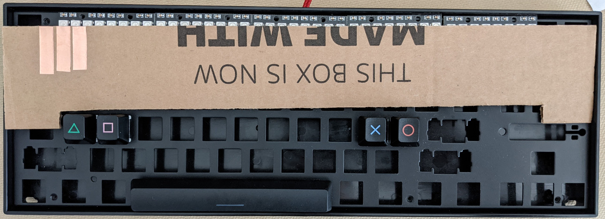

# DIY Project Diva Slide Pictures

Japanese PS4 PDFT dedicated controller option enabled and using
cardboard diva slider.

https://user-images.githubusercontent.com/65133219/126855471-896db800-e589-409e-87d2-32102064c490.mp4

The same cardboard slider that works on a Switch is connected to a controller
adapter (Mayflash Magic S Pro). The adapter is connected to a PS4 USB port. The
cardboard controller does not have enough buttons so a DS4 is also connected to
the adapter via Bluetooth. Note the DS4 is paired with the adapter, not the
PS4. The PS4 sees only one controller (the Mayflash). The Mayflash creates a
kind of XBox co-pilot feature where more than one controller can be used for
the same player.

```
Cardboard slider -> Mayflash Magic S Pro -> PS4 USB
                          /
                         /// (BT wireless)
                          /
                         DS4
```

Keyboard controller with slider in progress using Amazon's Finest Single Tree
Private Reserve prototyping material.


Nope, it is the same cardboard everyone gets.



Cardboard Diva controller with slide. The flattest Diva controller ever?


Cardboard Diva controller test.

https://user-images.githubusercontent.com/65133219/126053064-534e4a8a-b537-4eb9-b7ec-8ac595bd188f.mp4

